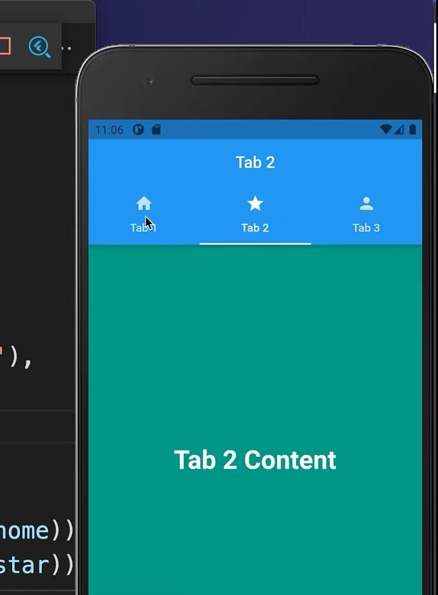

## Make a Toolbar application dart

Make a Toolbar application like google maps with dart programming language.

## Getting Started

This project is a starting point for a Flutter application.

If you face any problem with this project or repositories just contact with me on 
- facebook: www.facebook.com/munemuddin.engineer
- instagram: www.instagram.com/munemsarker
